## 0.问题描述

#### 问题背景

经典的影响力最大化问题研究如何在社交网络中选择种子节点以最大化信息传播范围。优惠券扩散问题是其一个扩展：企业同时投放 k 个优惠券，每个优惠券选择一个种子用户进行分发，各优惠券在网络中独立传播，目标是最大化至少领取了一个优惠券的用户总数。


#### 网络与节点行为

给定有向图 G=(V,E)，每个节点 u 收到优惠券后有三种行为：

- **领取（Adopt）**：以概率 $\alpha_u$ 领取优惠券，扩散终止于该节点；
- **丢弃（Discard）**：以概率 $\beta_u$ 丢弃优惠券，扩散终止；
- **转发（Transfer）**：以概率 $p_{(u,v)}$ 将优惠券转发给出邻居 v。

三者满足  $\alpha_u$  +$\beta_u$+ $Σ_vp_{(u,v)}$ = 1。


#### 扩散模型

共有 k 个优惠券，每个独立扩散。通过为每个优惠券 j 独立采样随机数来构造可能世界 $W_j$，确定每个节点的行为（领取/丢弃/转发）和活边（Live Edge）。节点 u 在第 j 个世界中被激活，当且仅当存在从种子 $s_j $到 u 的活边路径，路径上所有中间节点均处于转发状态，且 u 本身触发领取事件。


#### 优化目标

给定种子集合 S = (s₁, ..., sₖ)，定义优化目标 为至少在某个世界中领取了优惠券的节点数期望：

$$\max_{S} \mathbb{E}\left[\left|{u \in V : u \text{ 至少领取一个优惠券}}\right|\right]$$

该目标函数具有子模性，因此可用贪心算法获得 $(1-1/e) $近似比，并通过反向可达集实现高效采样与求解。


#### RR 集采样算法

基于反向可达集（RR Set）的采样方法，流程如下：

1. **均匀采样根节点**：从节点集合 V 中均匀随机选取一个节点 v。

2. **判定领取事件**：对节点 v，独立采样 k 个均匀随机数 r₁, r₂, ..., rₖ ∈ [0,1]，分别判断在每个优惠券世界中 v 是否触发领取事件 $Adopt_j(v)$（即 $r_j$ ≤ a(v)）。

3. 反向生成 RR 集

   对每个优惠券 j = 1, ..., k：

   - 若 $Adopt_j(v)$ 为真，则从 v 出发反向生成第 j 个 RR 集 $R_j(v)$；
   - 具体过程：遍历 v 的入邻居 w，若 w 的随机数尚未生成则现场采样，根据采样结果判断边 (w, v) 是否为活边——即检查 w 的随机数是否落在对应 (w, v) 的转发区间内；若是活边则将 w 加入 RR 集，并继续以 DFS 方式向 w 的入邻居扩展；
   - 若 $Adopt_j(v)$ 为假，则跳过，不生成该 RR 集。


#### 贪心选种子算法

基于上述 RR 集采样，利用目标函数的子模性，使用贪心策略依次选取 k 个种子节点：

1. 重复采样大量 RR 集（每次采样产生 k 个 RR 集，对应 k 个优惠券世界）；
2. 第 j 轮选择种子时，在所有第 j 组 RR 集 ${R_j(v)}$ 中，选取覆盖最多 RR 集的节点作为 $s_j$；
3. 依次选取 s₁, s₂, ..., sₖ，每轮选使边际增益最大的节点。

这一流程类似经典 IC 模型中基于 RR 集的贪心算法，区别在于每个根节点 v 会同时产生 k 个 RR 集，且仅保留 Adopt 事件为真的那些。


## 1.数据集

```
\begin{table}[htbp]
\centering
\caption{Characteristics of the real-world datasets used in the experiments.}
\label{tab:datasets}
\begin{tabular}{lcccccc}
\toprule
Dataset Name & Nodes ($n$) & Edges ($m$) & Avg. Degree & Max Out-degree & Sparsity \\
\midrule
Netscience     & 379    & 1,828   & 4.82  & 34    & 98.72\%  \\
NetFacebookEgo & 2,888  & 5,962   & 2.06  & 769   & 99.93\%  \\
DoubanRandom   & 4,723  & 11,774  & 2.49  & 45    & 99.95\%  \\
EmailEnron     & 33,696 & 361,622 & 10.73 & 1,383 & 99.97\%  \\
network.douban & 154907 & 654,206 & 4.22  & 287   & 99.97\%  \\
\bottomrule
\end{tabular}
\end{table}
```


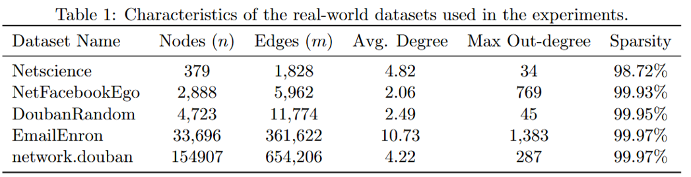

## 2.节点状态转移

`````

\begin{algorithm}[t]
\caption{Single-Node Transition Kernel in Coupon World $W_j$}
\label{alg:single-node-kernel}
\begin{algorithmic}[1]
\Require Current node $u$; coupon index $j$; adoption probabilities $\{\alpha_x\}_{x\in V}$; discard probabilities $\{\beta_x\}_{x\in V}$; transfer probabilities $\{p_{xy}\}_{(x,y)\in E}$
\Ensure Local outcome at node $u$: $(A_{u,j}, D_{u,j}, v)$, where $v$ is the next-hop node if a transfer occurs

\State Sample $r_{u,j} \sim \Unif[0,1]$

\If{$r_{u,j} \in [0,\alpha_u]$}
    \State $A_{u,j} \gets 1$, \quad $D_{u,j} \gets 0$
    \State \Return $(1,0,\emptyset)$ \Comment{Node $u$ adopts the coupon}

\ElsIf{$r_{u,j} \in (\alpha_u,\alpha_u+\beta_u]$}
    \State $A_{u,j} \gets 0$, \quad $D_{u,j} \gets 1$
    \State \Return $(0,1,\emptyset)$ \Comment{Node $u$ discards the coupon}

\Else
    \State $A_{u,j} \gets 0$, \quad $D_{u,j} \gets 0$
    \State Define the conditional transfer distribution
    \[
    \Pr[v=w \mid \text{transfer at }u]
    =
    \frac{p_{uw}}{\sum_{x\in N^+(u)} p_{ux}},
    \qquad \forall w \in N^+(u)
    \]
    \State Sample $v$ from the above distribution
    \State Set $e_{u,v,j} \gets 1$
    \State \Return $(0,0,v)$ \Comment{Node $u$ transfers the coupon to $v$}
\EndIf
\end{algorithmic}
\end{algorithm}

`````


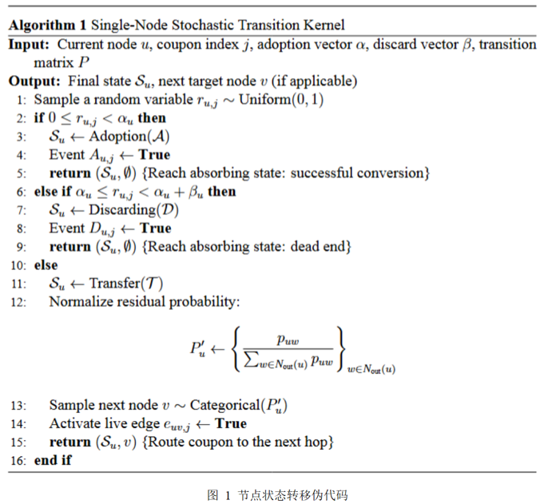

## 3.RR-set采样过程伪代码

`````tex

\usepackage{algorithm}
\usepackage{algpseudocode}

\begin{algorithm}[t]
\caption{Conditioned Union RR-Set Generation}
\label{alg:conditioned_union_rr}
\begin{algorithmic}[1]
\Require Directed graph $G=(V,E)$; adoption probabilities $\{\alpha_u\}_{u\in V}$; discard probabilities $\{\beta_u\}_{u\in V}$; transfer probabilities $\{p_{uv}\}_{(u,v)\in E}$; number of coupons $k$
\Ensure A valid union RR sample $Q(v,W)$

\State Uniformly sample a root node $v \in V$
\State Sample $k$ independent random values $r_{v,1},r_{v,2},\ldots,r_{v,k} \sim \Unif[0,1]$
\For{$j=1$ to $k$}
    \State $A_{v,j} \gets \mathbb{I}\{r_{v,j} \in [0,\alpha_v]\}$
\EndFor

\If{$\bigwedge_{j=1}^{k} (A_{v,j}=0)$}
    \State \Return $\emptyset$ \Comment{Reject zero-contribution sample}
\EndIf

\State Initialize $Q(v,W) \gets \emptyset$

\For{$j=1$ to $k$}
    \If{$A_{v,j}=1$}
        \State Initialize $R_{v,j} \gets \{v\}$, queue $\mathcal{Q} \gets \{v\}$
        \While{$\mathcal{Q}$ is not empty}
            \State Pop a node $u$ from $\mathcal{Q}$
            \For{each in-neighbor $w \in N^{-}(u)$}
                \If{$r_{w,j}$ has not been generated}
                    \State Sample $r_{w,j} \sim \Unif[0,1]$
                \EndIf
                \State Determine whether $(w,u)$ is a live edge in world $W_j$
                \If{$(w,u)$ is live \textbf{and} $w \notin R_{v,j}$}
                    \State $R_{v,j} \gets R_{v,j} \cup \{w\}$
                    \State Push $w$ into $\mathcal{Q}$
                \EndIf
            \EndFor
        \EndWhile
        \State $Q(v,W) \gets Q(v,W) \cup R_{v,j}$
    \EndIf
\EndFor

\State \Return $Q(v,W)$
\end{algorithmic}
\end{algorithm}

`````


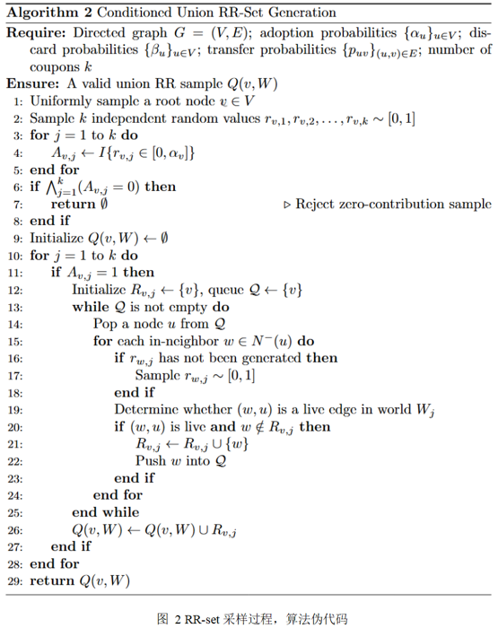


## 4. 实验三种情况的设置

- 节点行为满足概率守恒：$\alpha_v (\text{核销}) + \beta_v (\text{丢弃}) + \gamma_v (\text{转发}) = 1$
- 通过调整 `base` 和 `slope` 参数，构建三种场景
- 同一个底层概率矩阵

每个节点概率的生成的伪代码

```tex
\begin{algorithm}[t]
\caption{Generate Log-Continuous Degree-Based Distributions}
\label{alg:log-continuous-distribution}
\begin{algorithmic}[1]
\Require Number of nodes $n$; degree array $\{\deg_i\}_{i=1}^n$; configuration parameters $\textit{config}$
\Ensure A distribution dictionary containing success, discard, transfer

\State Initialize random generator $\textit{rng}$ with seed $\textit{config.rng}$

\For{$i=1$ to $n$}
    \State $\logdeg_i \gets \log(1+\deg_i)$
\EndFor
\State $\textit{max\_log} \gets \max_{1 \le i \le n} \logdeg_i$
\If{$\textit{max\_log}=0$}
    \State $\textit{max\_log} \gets 1.0$
\EndIf

\For{$i=1$ to $n$}
    \State $\textit{base\_norm}_i \gets \textit{log\_degree}_i / \textit{max\_log\_degree}$
    \State $\textit{safe\_base}_i \gets \min\{1.0,\max\{10^{-5},\textit{base\_norm}_i\}\}$
    \State $\textit{norm\_deg}_i \gets (\textit{safe\_base}_i)^{\textit{config.degree\_power\_h}}$
    \State $\textit{norm\_deg}_i \gets \min\{1.0,\max\{0.0,\textit{norm\_deg}_i\}\}$
\EndFor

\For{$i=1$ to $n$}
    \State $\mathbb{E}[\alpha_i] \gets \textit{config.log\_alpha\_base} + \textit{config.log\_alpha\_slope} \cdot (1-\textit{norm\_deg}_i)$
    \State $\mathbb{E}[\beta_i] \gets \textit{config.log\_beta\_base} + \textit{config.log\_beta\_slope} \cdot \textit{norm\_deg}_i$
\EndFor

\For{$i=1$ to $n$}
    \State $\mathbb{E}[\tau_i] \gets 1 - \mathbb{E}[\alpha_i] - \mathbb{E}[\beta_i]$
\EndFor


\State \Return
\[
\left\{
\begin{array}{l}
\texttt{succ\_distribution}: \mathbb{E}[\alpha_i],\\
\texttt{dis\_distribution}: \mathbb{E}[\beta_i],\\
\texttt{tran\_distribution}: \mathbb{E}[\tau_i],\\
\end{array}
\right\}
\]
\end{algorithmic}
\end{algorithm}

```


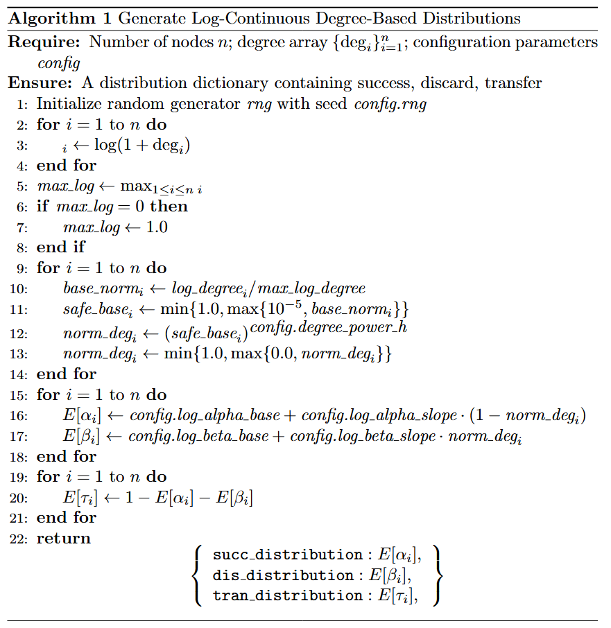

## 5.部分实验结果

#### 场景一：普通情况

```python
# config.py: 普通情况
log_alpha_base: float = 0.30
log_alpha_slope: float = 0.1
log_beta_base: float = 0.10
log_beta_slope: float = 0.1    
degree_power_h: float = 1.0    
```

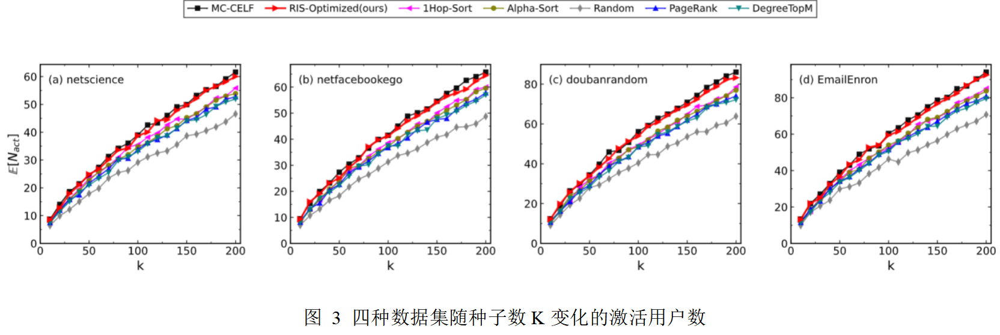


#### 场景二：高吸收场景

```python
# config.py: 高吸收场景 
# 核心逻辑：大幅调高基础核销率与丢弃率，极限压缩转发率

log_alpha_base: float = 0.45   # 基础核销率极高 (拿到券大概率直接用)
log_alpha_slope: float = 0.35  
log_beta_base: float = 0.15    # 基础丢弃率也较高 (不用就直接扔)
log_beta_slope: float = 0.05   

degree_power_h: float = 1.0    # 保持线性映射不变
```

> 任意节点的期望吸收率 $\mathbb{E}[\alpha_v + \beta_v] \approx 0.95$
> 导致全网平均转发率 $\mathbb{E}[\gamma_v] \le 0.05$
> 优惠券平均游走步数趋近于 1


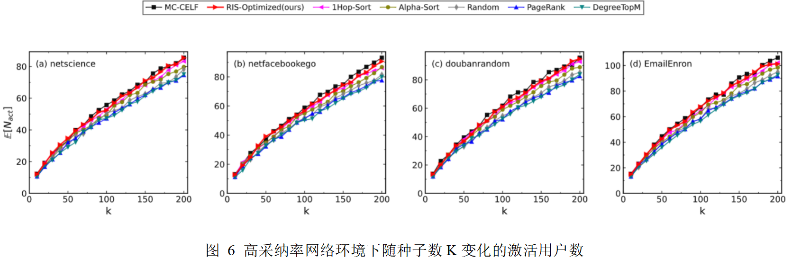


#### 场景三：高转发场景

```python
# config.py: 高转发场景 
# 核心逻辑：大幅压低基础核销率与丢弃率，极限放大转发率

log_alpha_base: float = 0.01   # 基础核销率极低 (用户自己不用)
log_alpha_slope: float = 0.05  
log_beta_base: float = 0.01    # 基础丢弃率极低 (用户也不反感)
log_beta_slope: float = 0.05   

degree_power_h: float = 1.0    # 保持线性映射不变
```

> 任意节点的期望吸收率 $\mathbb{E}[\alpha_v + \beta_v] \le 0.12$
> 导致全网平均转发率 $\mathbb{E}[\gamma_v] \ge 0.88$
> 平均游走步数大幅增加

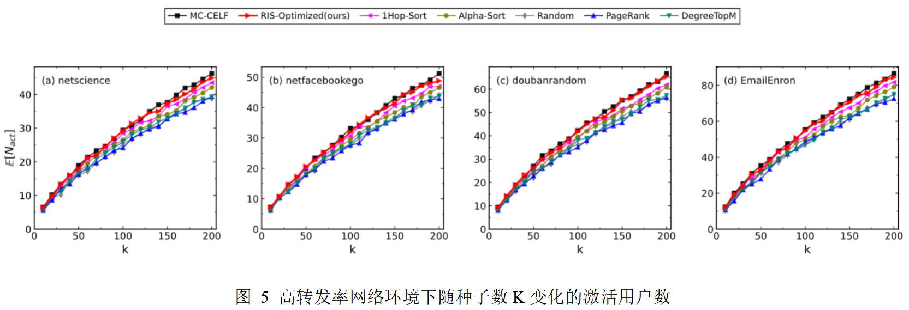


## 6.其他实验

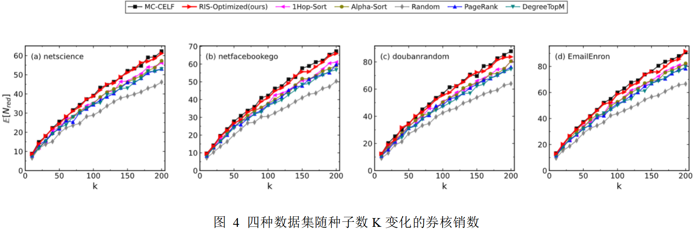


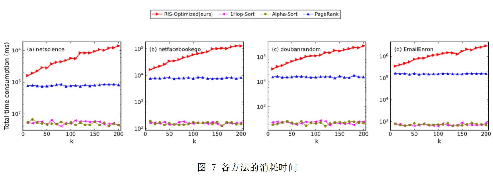


## 7.添加IMM、OPIM基准方法

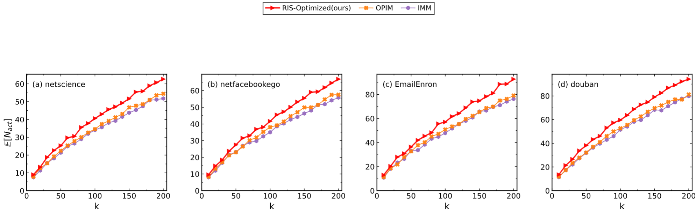


## 8.目前初稿前两段

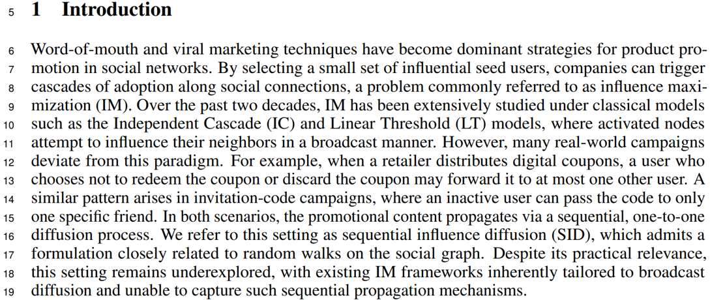


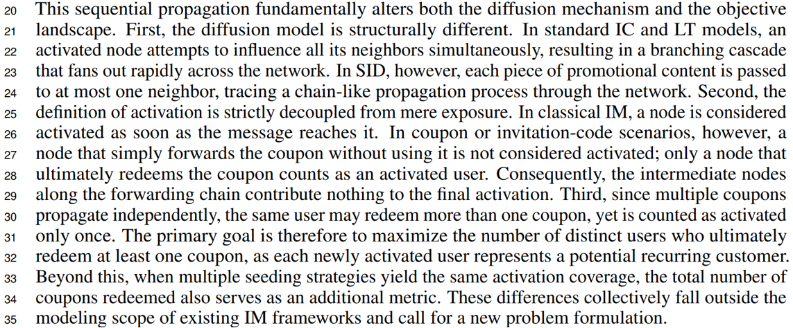